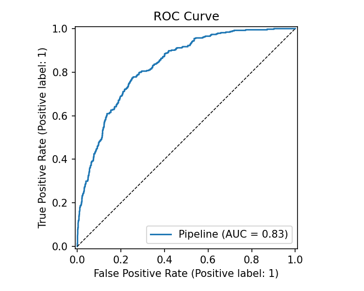
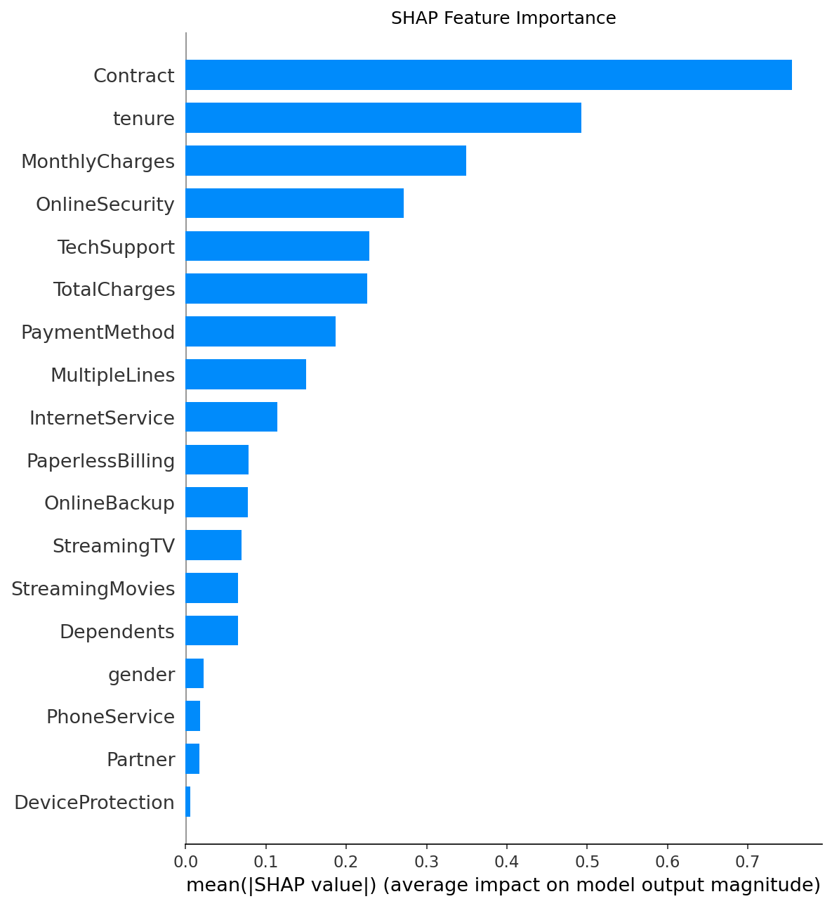
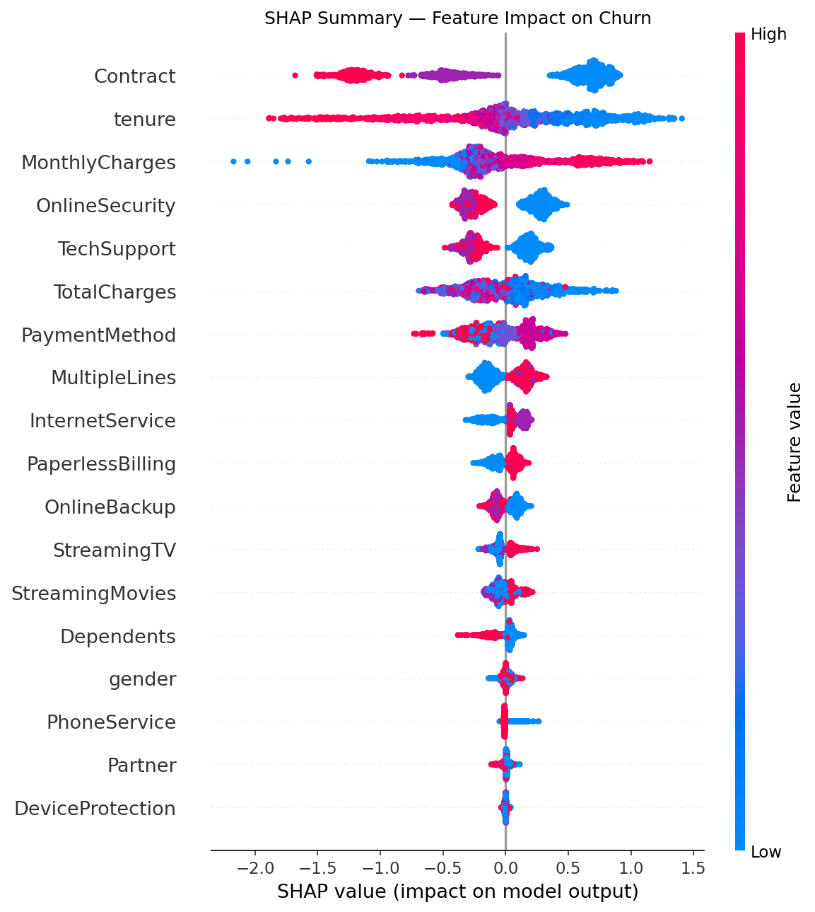

# ML Churn Predictor

End-to-end machine learning pipeline that predicts customer churn for a telecom provider, with SHAP explainability and an interactive Streamlit app.

---

## Overview

Customer churn is one of the most costly problems in the telecom industry. This project builds a full ML pipeline that identifies customers at risk of churning and explains why using SHAP values.

The key insight: **Logistic Regression outperformed XGBoost, Random Forest, and LightGBM** on this dataset (ROC-AUC: 0.83), demonstrating that understanding your data matters more than reaching for the most complex model.

---

## Demo

Adjust the customer profile in the sidebar to get a real-time churn probability, risk level, and a SHAP waterfall explanation for each prediction.

```bash
streamlit run app.py
```

---

## Results

| Metric | Score |
|---|---|
| ROC-AUC | 0.83 |
| Average Precision | 0.64 |
| True Positives (Churn correctly identified) | 301 |
| False Negatives (Churn missed) | 73 |

### ROC Curve


### SHAP Feature Importance


### SHAP Summary — Feature Impact on Churn


**Key findings from SHAP:**
- **Contract type** is by far the strongest predictor — month-to-month customers churn at a much higher rate
- **Tenure** is the second most important feature — newer customers are significantly more likely to churn
- **Monthly charges** and lack of **OnlineSecurity** / **TechSupport** are the next biggest drivers

---

## Project Structure

```
ml-churn-predictor/
├── app.py                  # Streamlit web app
├── run_pipeline.py         # End-to-end training script
├── requirements.txt
├── notebooks/
│   ├── 01_eda.ipynb        # Exploratory data analysis
│   └── 02_modelling.ipynb  # Model comparison and evaluation
├── src/
│   ├── preprocess.py       # Data cleaning and splitting
│   ├── features.py         # Feature engineering pipeline
│   ├── train.py            # Model training and CV
│   ├── evaluate.py         # Metrics and plots
│   ├── explain.py          # SHAP explainability
│   └── predict.py          # Inference helpers
├── models/
│   └── plots/              # Saved evaluation plots
└── data/                   # Not tracked — see below
```

---

## Setup

**1. Clone the repo**
```bash
git clone https://github.com/ashbix23/ML-Churn-Predictor.git
cd ML-Churn-Predictor
```

**2. Install dependencies**
```bash
pip install -r requirements.txt
```

**3. Download the dataset**

Download the [Telco Customer Churn dataset](https://www.kaggle.com/datasets/blastchar/telco-customer-churn) from Kaggle and place it at:
```
data/WA_Fn-UseC_-Telco-Customer-Churn.csv
```

**4. Run the pipeline**
```bash
python run_pipeline.py
```

This will train all models, run cross-validation, save the best model, and generate all SHAP and evaluation plots.

**5. Launch the app**
```bash
streamlit run app.py
```

---

## Stack

- **scikit-learn** — preprocessing pipeline, Logistic Regression, Random Forest
- **XGBoost / LightGBM** — gradient boosting models
- **SHAP** — model explainability
- **Streamlit** — interactive web app
- **pandas / numpy / matplotlib / seaborn** — data processing and visualization

---

## Data

The dataset is not included in this repo. Download it from Kaggle:
[https://www.kaggle.com/datasets/blastchar/telco-customer-churn](https://www.kaggle.com/datasets/blastchar/telco-customer-churn)
